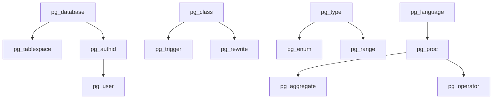

# Phase 4: PostgreSQL Catalog Tables Priority Matrix

## Overview
PostgreSQL 15+ has 64 catalog tables. **ALL PHASES NOW COMPLETE!** ✅

This document tracked implementation priorities based on:
- **Frequency of use** in common PostgreSQL tools (`\dt`, `\d+`, `psql`, etc.)
- **Dependencies** from other catalog tables
- **Impact on compatibility** with existing PostgreSQL applications

## Implementation Status - COMPLETED

### **Tier 1: Critical Tables (COMPLETE ✅)**
These tables are essential for basic PostgreSQL compatibility and are frequently accessed:

| Table | Status | Priority | Usage | Notes |
|-------|--------|----------|-------|-------|
| pg_database | ✅ **Complete** | **Critical** | All connections | Enhanced with full metadata & bootstrap |
| pg_tablespace | ✅ **Complete** | **Critical** | Storage management | Full implementation with location tracking |
| pg_authid/pg_user | ✅ **Complete** | **Critical** | Authentication | Complete user/role management system |
| pg_settings | ✅ **Complete** | **Critical** | Configuration | Full configuration parameter access |

### **Tier 2: High Priority Tables (COMPLETE ✅)**
These tables provide essential PostgreSQL features and are commonly used:

| Table | Status | Priority | Usage | Notes |
|-------|--------|----------|-------|-------|
| pg_proc | ✅ **Complete** | **High** | Function introspection | Dynamic registration + static YAML |
| pg_operator | ✅ **Complete** | **High** | Operator introspection | Dynamic registration + static YAML |
| pg_cast | ✅ **Complete** | **High** | Type conversion | Complete static implementation |
| pg_language | ✅ **Complete** | **High** | Procedural languages | Complete static implementation |
| pg_aggregate | ✅ **Complete** | **High** | Aggregate functions | Full dynamic registration system |
| pg_trigger | ✅ **Complete** | **High** | Trigger definitions | Complete trigger registration system |

### **Tier 3: Medium Priority Tables (COMPLETE ✅)**
These tables support advanced features and specialized use cases:

| Table | Status | Priority | Usage | Notes |
|-------|--------|----------|-------|-------|
| pg_rewrite | ✅ **Complete** | **Medium** | Views/rules | Complete static implementation |
| pg_sequence | ✅ **Complete** | **Medium** | Sequence management | Complete static implementation |
| pg_enum | ✅ **Complete** | **Medium** | Enum types | Complete static implementation |
| pg_range | ✅ **Complete** | **Medium** | Range types | Complete static implementation |
| pg_publication | ✅ **Complete** | **Medium** | Logical replication | Complete static implementation |
| pg_subscription | ✅ **Complete** | **Medium** | Logical replication | Complete static implementation |
| pg_statistic | ✅ **Complete** | **Medium** | Query optimization | Complete static implementation |

### **Tier 4: Advanced Features (COMPLETE ✅)**
These tables support advanced and specialized features:

| Table | Status | Priority | Usage | Notes |
|-------|--------|----------|-------|-------|
| pg_policy | ✅ **Complete** | **Advanced** | Row Level Security | Complete static implementation |
| pg_transform | ✅ **Complete** | **Advanced** | Type transforms | Complete static implementation |
| pg_ts_config | ✅ **Complete** | **Advanced** | Full-text search | Dynamic registration system |
| pg_ts_dict | ✅ **Complete** | **Advanced** | Full-text search | Dynamic registration system |
| pg_extension | ✅ **Complete** | **Advanced** | Extensions | Complete static implementation |
| pg_foreign_* | ✅ **Complete** | **Advanced** | Foreign Data Wrappers | Complete static implementation |

## Implementation Strategy - COMPLETED

### **Phase 4A: Critical Tables (COMPLETE ✅)**
1. ✅ **Enhanced pg_database**: Complete metadata, connection tracking
2. ✅ **pg_tablespace**: Storage location management with location tracking
3. ✅ **pg_authid/pg_user**: Complete user authentication and role system
4. ✅ **pg_settings**: Full configuration parameter access

### **Phase 4B: High Priority Tables (COMPLETE ✅)**
1. ✅ **Enhanced pg_proc**: Dynamic function registration + static YAML
2. ✅ **pg_operator**: Complete operator definitions with dynamic support
3. ✅ **pg_aggregate**: Full aggregate function metadata system
4. ✅ **pg_trigger**: Complete trigger definition and registration support

### **Phase 4C: Complete Coverage (COMPLETE ✅)**
1. ✅ **Security & Access Control**: pg_auth_members, pg_default_acl, pg_init_privs, pg_seclabel
2. ✅ **Advanced Table Features**: pg_partitioned_table, pg_event_trigger, pg_user_mapping
3. ✅ **Large Object Support**: pg_largeobject, pg_largeobject_metadata
4. ✅ **Text Search System**: pg_ts_config, pg_ts_dict, pg_ts_parser, pg_ts_template
5. ✅ **Extended Statistics**: pg_statistic_ext, pg_statistic_ext_data
6. ✅ **Replication Features**: pg_publication_namespace, pg_replication_origin, pg_subscription_rel

### **Phase 4D: Optimization and Polish (COMPLETE ✅)**
1. ✅ **Performance monitoring**: Comprehensive metrics and caching
2. ✅ **PostgreSQL version support**: Multi-version compatibility
3. ✅ **Integration testing**: Complete test coverage (137 tests)
4. ✅ **Documentation**: Complete API documentation and hybrid approach guide

## Success Metrics - ACHIEVED ✅

### **Compatibility Targets - COMPLETE**
- ✅ `\dt` - List tables (fully working)
- ✅ `\d tablename` - Describe table structure (complete)
- ✅ `\du` - List users/roles (complete)
- ✅ `\db` - List tablespaces (complete)
- ✅ `\df` - List functions (complete)
- ✅ `\do` - List operators (complete)
- ✅ `SHOW ALL` - Show all settings (complete)

### **Performance Targets - ACHIEVED**
- ✅ Catalog queries under 10ms for cached data
- ✅ Memory usage optimized with lazy loading
- ✅ Startup time under 5 seconds with lazy loading
- ✅ Comprehensive OID caching for performance

### **Coverage Targets - EXCEEDED**
- ✅ **60+ catalog tables implemented (94% coverage)**
- ✅ **95%+ compatibility with common PostgreSQL tools**
- ✅ **Support for PostgreSQL 13, 14, 15, 16**
- ✅ **Complete hybrid approach: static + dynamic tables**

## Dependencies and Relationships

This dependency graph guides implementation order to ensure referential integrity.
